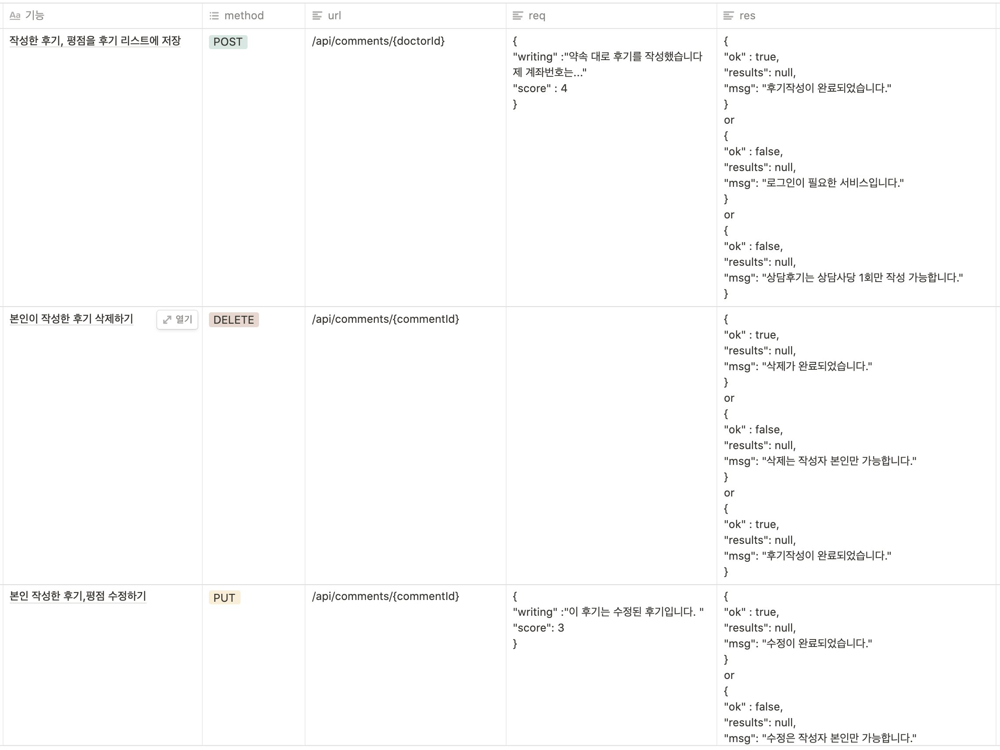
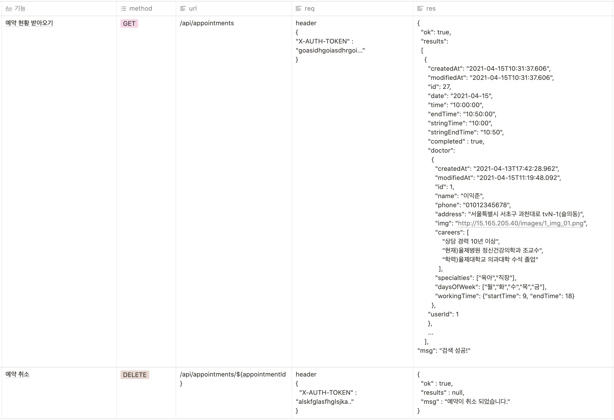

## miniProject "Mind Care" Backend
정신과 상담에 대한 접근성을 높이기 위한 상담사 매칭 플랫폼

### 
### Frontend github link
- ["Mind Care" Frontend](https://github.com/kim-jiha95/mindcare)

### 함께한 팀원
- Frontend : 김지하, 주형인
- Backend : 천재승, 손윤환

### 진행 기간
- 2021년 4월 9일 ~ 2021년 4월 22일 (2주 간) 

### 사용 언어 및 Tools
- 주요 구현 : Java & Spring Framework(Springboot, SpringSecurity, Spring Data JPA 등) 
- JWT 생성/활용 : jjwt
- 주기적 DB Update : scheduling tasks
- 코드 간소화 : lombok
- 서버 호스팅 : EC2
- DB : AWS Amazon RDS
- RDB 엔진 : MySQL

### ER Diagram
  

### 주요 구현 기능(APIs, DB 구축)
1. 로그인/회원가입 
   - JWT(Json Web Token) 생성/확인/인증처리 등의 기능 구현
       
2. 상담사 검색
   - 가상의 상담사 DB 구축
   - 상담사 검색 기능 구현 
     
3. 상담사 세부 정보  
   - 상담사 세부 정보  
     
   - 후기(Comment),평점(Star) 조회/작성/삭제/수정
     - 후기 작성/수정/삭제 시 상담사의 고유 평점이 업데이트 되는 기능 구현 
     - ※ 상담사 테이블 접근을 최소화하기 위해 평점(Star) 테이블을 분리하여 관리(ER Diagram 참고)
     
4. 예약하기
   - java.time 패키지를 사용하여 예약일, 예약시간 등을 기입
   - 상담사 고유 정보의 근무일, 근무시간 등과의 비교를 통해 예약일정이 겹치지 않게 함
   
5. 마이 페이지
   - Scheduling Tasks를 활용하여 주기적으로 DB 내 예약정보(상담완료,상담대기)를 업데이트 해줌
   
